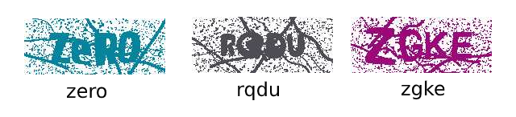

# ulozto-captcha-breaker
Deep learning model using Tensorflow that breaks ulozto captcha codes.



Algorithm used will be described in a standalone document.

## How to use pretrained model in your project
### Prerequisities
Packages
- *numpy~=1.18.3*
- *tflite_runtime~=2.5.0*

You need to install Tensorflow Lite Runtime with the correct version depending on your operating system and instruction set. 
It can be found here: https://www.tensorflow.org/lite/guide/python.

### Model specification
- Input shape: (batch_size, height, width, 1), where height = 70, width = 175
- Output shape: (batch_size, number_of_letters, number_of_classes), where number_of_letters = 4 and number_of_classes = 26

Note that it takes **grayscale images** as the input. RGB images therefore have to be converted.

### Steps
1. Go to latest release and download binary files
2. Instantiate the tflite interpreter. For that you're going to need TFLite model. You can find it in the release binary files.
    - PATH_TO_TFLITE_MODEL is path to directory containing the neural network pretrained model
    ```python
   import tflite_runtime.interpreter as tflite
   interpreter = tflite.Interpreter(model_path=PATH_TO_TFLITE_MODEL)
   ```

3. Normalize image to 0..1 interval. If it already is, skip this step.
    ```python
    img = (img / 255).astype(np.float32)
    ```
4. Predict using following code
    ```python
    # convert to grayscale
    r, g, b = img[:, :, 0], img[:, :, 1], img[:, :, 2]
    input = 0.299 * r + 0.587 * g + 0.114 * b
    
    # input has nowof  shape (70, 175)
    # we modify dimensions to match model's input
    input = np.expand_dims(input, 0)
    input = np.expand_dims(input, -1)
    # input is now of shape (batch_size, 70, 175, 1)
    # output will have shape (batch_size, 4, 26)
   
    interpreter.allocate_tensors()
    input_details = interpreter.get_input_details()
    output_details = interpreter.get_output_details()
    interpreter.set_tensor(input_details[0]['index'], input)
    interpreter.invoke()

    # predict and get the output
    output = interpreter.get_tensor(output_details[0]['index'])
    # now get labels
    labels_indices = np.argmax(output, axis=2)

    available_chars = "abcdefghijklmnopqrstuvwxyz"

    def decode(li):
        result = []
        for char in li:
            result.append(available_chars[char])
        return "".join(result)

    decoded_label = [decode(x) for x in labels_indices][0]
    ```
    - *np* for numpy

## How to train your own model
1. Install environment
    Following script creates new virtual environment. You can of course use global environment instead.
    All following section's scripts are expected to be executed from repository's root directory.
    ```shell script
    git clone https://github.com/JanPalasek/ulozto-captcha-breaker
    cd "ulozto-captcha-breaker"
    
    # create virtual environment
    python -m venv "venv"
    
    source venv/bin/activate # or .\venv\Scripts\activate.ps1 in windows Powershell
    python -m pip install -r "requirements.txt" -e .
    ```
2. Obtain dataset of captcha images and store it to directory *out/data*. Images are expected to be named according
to captcha displayed in the image.

    E.g.
    
    
    
    This captcha image is expected to be named e.g. *ABFD.png*, *abfd.png* (if we don't care about case sensitivity)
    or e.g. *ABFD_{UUID4 CODE}.png* (to distinguish different images for same captcha letters).
    
    This project contains a way to generate captchas yourself using *captcha* Python package using script *bin/simple_captcha_generate.py*.
    You can run it in a following manner
    ```shell script
    python bin/simple_captcha_generate.py --height=70 --width=175 --available_chars="abcdefghijklmnopqrstuvwxyzABCDEFGHIJKLMNOPQRSTUVWXYZ" --captcha_length=6 --dataset_size=10000
    ```
    
    Some of notable parameters are:
    - *available_chars* - list of characters that will be generated
    - *captcha_length* - how long generated captcha is going to be
    - *dataset_size* - how large dataset is going to be generated
    - *height* - height of generated captcha
    - *width* - width of generated captcha

3. Generate *annotations* files using *bin/captcha_annotate.py* script. You can call it for example
    ```shell script
    python bin/captcha_annotate.py --val_split=0.1 --test_split=0.1 --case_sensitive
    ```
    This will shuffle and split data into train/validation/test according to following parameters:
    - *val_split* - how large part of data is going to be used for validation, e.g. 0.1 means 10%
    - *test_split* - how large part of data is going to be used for testing
    - *case_sensitive* - switch denoting that labels that are created will be case sensitive
        - if such parameter is not passed, then for example if *aBcD* is in the image (and image is named accordingly),
        resulting label will be *abcd*
        - if it is passed, resulting label will be *aBcD*
    
    This script will create *annotations.txt*, *annotations-train.txt*, *annotations-validation.txt* and *annotations-test.txt*.

4. Run training script *bin/train.py* for example like this:
    ```shell script
    python bin/train.py --available_chars="abcdefghijklmnopqrstuvwxyzABCDEFGHIJKLMNOPQRSTUVWXYZ" --captcha_length=6 
    ```
   Training script notably logs models after each checkpoint into *logs/train.py-{START TIMESTAMP}-{parameters etc.}* directory.
